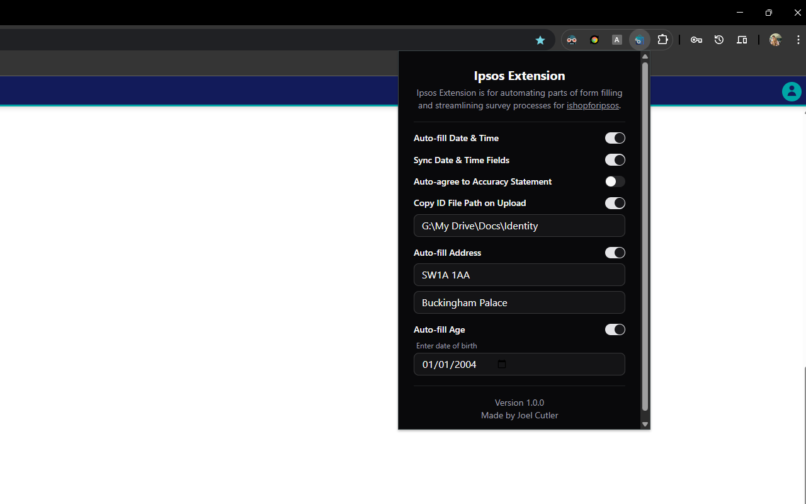

#  &nbsp; Ipsos Extension

Ipsos Extension is for automating parts of form filling and streamlining survey processes for [ishopforipsos](https://uk.ishopforipsos.com/).

Currently supported Forms:

- Retail Home Delivery

<!-- ## Production Build -->

## Run Locally

1. Install dependencies: `npm i`
2. Build to `/dist`: `npm run build`
3. Open Chrome and navigate to `chrome://extensions`
4. Enable "Developer Mode" in the top right
5. Select "Load unpacked" and select the `/dist` folder

## Licence

[Apache License 2.0](LICENSE)
